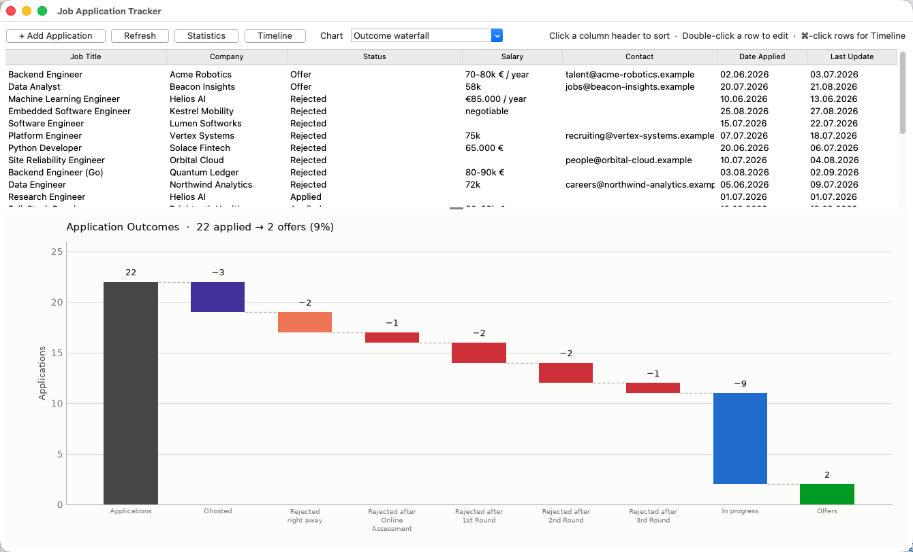
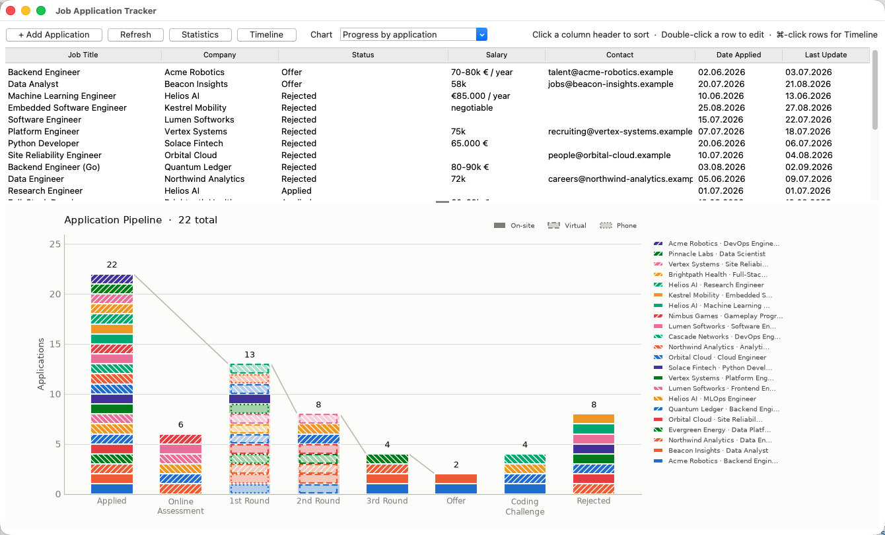
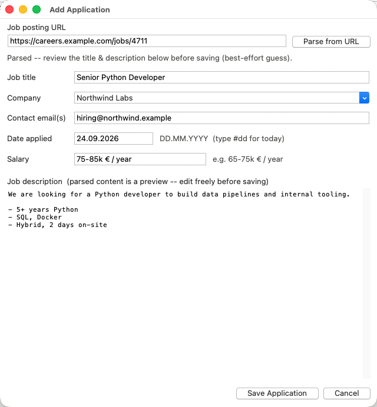
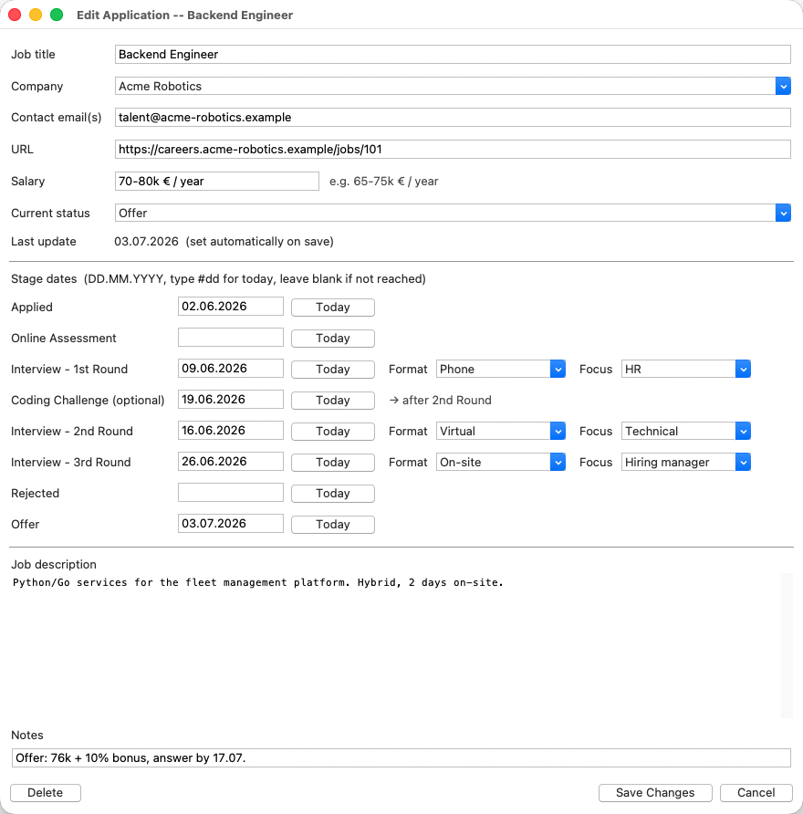
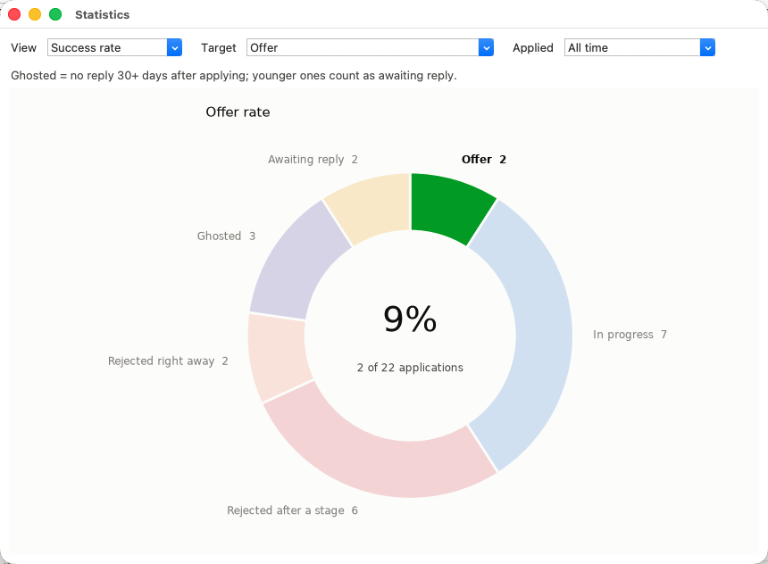
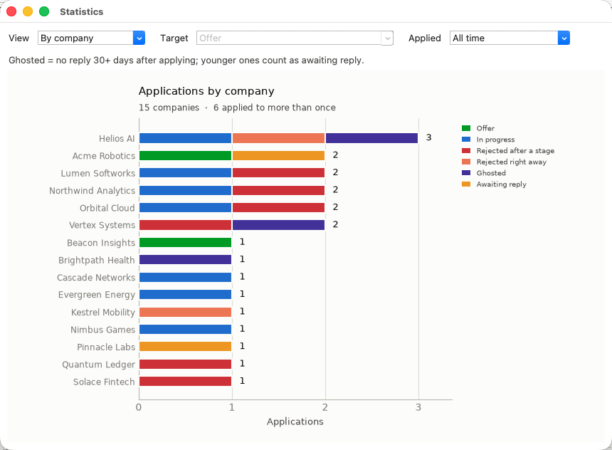
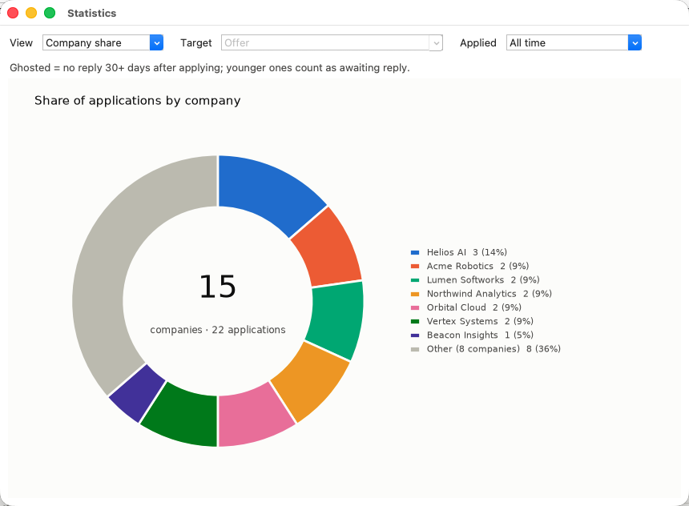
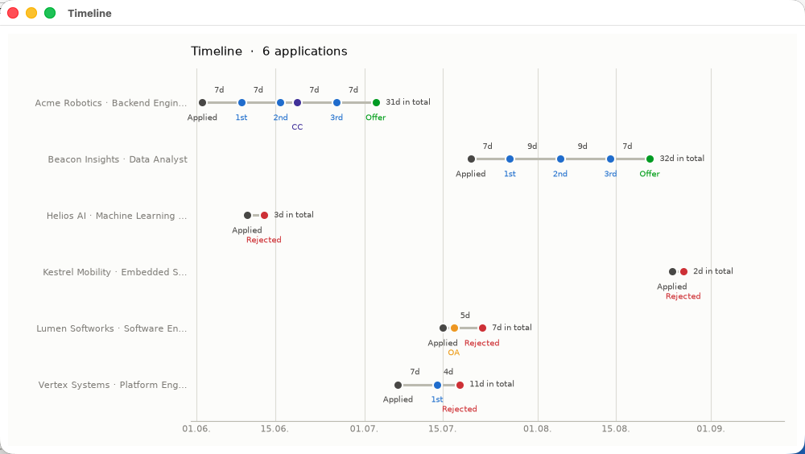

# Job Application Tracker

A small desktop app for keeping track of job applications: where you applied,
how far each application got, and how the whole search is going. It is written
in Python with Tkinter and matplotlib, and keeps everything in one local CSV
file, so nothing leaves your machine.



## Features

- **Application list** with sortable columns (title, company, status, salary,
  contact, dates).
- **Add from a URL**: paste a job posting link and the app makes a best-effort
  guess at the title and description for you to review.
- **Stage tracking**: Applied → Online Assessment → 1st / 2nd / 3rd Round →
  Offer, plus an optional Coding Challenge and Rejected, each with its own
  date. Interview rounds are tagged with a format (On-site, Virtual, Phone)
  and a focus (Technical, HR, Hiring manager).
- **Charts**: an outcome waterfall and a per-stage progress chart in the main
  window, success rates and company breakdowns in the Statistics window, and a
  timeline of selected applications.
- **Plain CSV storage** in `data/applications.csv`, which you can open in any
  spreadsheet program.

## Setting up the Python environment

### Requirements

- **Python 3.12 or newer** (the code uses 3.12 syntax).
- **Tkinter**. It ships with the python.org installers. Elsewhere you may need
  to install it separately:
  - macOS with Homebrew: `brew install python-tk@3.12`
  - Debian / Ubuntu: `sudo apt install python3-tk`
  - Fedora: `sudo dnf install python3-tkinter`
- **Git LFS**, only if you want the bundled example data
  (`data/applications.csv` is stored with LFS).

Check that Python and Tkinter work:

```bash
python3 --version          # 3.12 or newer
python3 -m tkinter         # opens a small test window
```

### Create a virtual environment

From the project root:

```bash
python3 -m venv .venv
source .venv/bin/activate          # Windows: .venv\Scripts\activate
pip install -r requirements.txt
```

`requirements.txt` installs matplotlib (charts), click (command line),
requests, beautifulsoup4 and lxml (parsing job postings).

### Development setup (optional)

To run the tests and the linting hooks, install the development requirements
as well and register the pre-commit hooks:

```bash
pip install -r requirements-dev.txt
pre-commit install
```

```bash
pytest                         # run the test suite
pre-commit run --all-files     # ruff lint + format, tests, file checks
```

The hooks expect the virtual environment at `.venv/`.

## Running the app

```bash
python run.py [CSV_PATH]
```

(or `.venv/bin/python run.py [CSV_PATH]` without activating the environment).

`CSV_PATH` is the file your applications are read from and saved to:

```bash
python run.py                                # bundled example data
python run.py ~/Documents/applications.csv   # your own file
python run.py --help                         # show usage
```

- **Without a path**, the app opens `data/applications.csv`, which ships with
  22 example applications so you can explore every view straight away.
- **With a path to a file that does not exist yet**, the app starts empty and
  creates the file (and any missing folders) when you save your first
  application.

Keeping your own data in a file outside the repository keeps it separate
from the example data.

## Using the app

### Main window

The main window shows your applications above a chart.

- **Sort** by clicking a column header; click it again to reverse the order.
  Empty values always go last. Salaries sort by amount, and statuses in
  pipeline order.
- **Edit** an application by double-clicking its row.
- **Select several rows** with ⌘-click (Ctrl-click on Windows/Linux) or
  Shift-click, then press **Timeline** to compare them.
- **Refresh** reloads the CSV, handy if you edited it in another program.
- The **Chart** dropdown switches between two views:

**Outcome waterfall** (shown above) starts with all applications and peels
off where each one ended: ghosted, rejected right away, rejected after a
given stage, still in progress, and finally the offers.

**Progress by application** stacks every application on each stage it
reached, so you can see the funnel narrow. The hatching shows the interview
format: solid for on-site, hatched for virtual, dotted for phone.



In the Status column, interview rounds show their tags as letters, e.g.
`Interview - 2nd Round · V T` for a virtual technical round (format:
**O**n-site, **V**irtual, **P**hone; focus: **T**echnical, **H**R, hiring
**M**anager).

### Adding an application

Click **+ Add Application**.



1. Optionally paste the **job posting URL** and press **Parse from URL**. The
   app downloads the page and fills in the title and description. This is a
   heuristic guess at arbitrary web pages, so check and edit the result
   before saving. Some sites block automated requests or load their content
   with JavaScript; in that case just copy the description in by hand.
2. Fill in the **job title** (required), **company**, **contact email(s)**
   and **salary**. The company field suggests companies you have applied to
   before. Separate several email addresses with commas.
3. **Date applied** defaults to today. Dates are written as `DD.MM.YYYY`.
4. Press **Save Application**.

**Tip:** in any date or text field, typing `#dd` replaces it with today's
date.

### Updating an application

Double-click a row to open the edit dialog.



- Set **Current status** to where the application stands now.
- Enter the date for every **stage** you reached, using the **Today** button
  or `#dd`, and leave stages you did not reach blank. These dates drive the
  charts and the timeline.
- For each **interview round**, choose its **Format** (defaults to Virtual)
  and, optionally, its **Focus**.
- The **Coding Challenge** is optional and can happen between any two
  rounds. The dialog shows where it falls, e.g. "→ after 2nd Round", based
  on the dates.
- **Notes** is a free-text field for anything else, such as offer details or
  deadlines.
- **Last update** is set automatically on every save.
- **Delete** removes the application permanently (after asking).

### Statistics

Press **Statistics** to open the statistics window. Use the **Applied**
filter to limit it to applications sent in the last 30 or 90 days or the last
12 months.

**Success rate** shows what share of applications reached a **Target**:
an offer, an assessment or interview, any reply at all, a rejection, or being
ghosted.



**By company** shows the outcomes per company, and makes it easy to spot
companies you have applied to more than once.



**Company share** shows how your applications are spread across companies.



#### How outcomes are counted

Every application falls into exactly one outcome, based on its stage dates
and current status:

| Outcome                    | Meaning                                                   |
|----------------------------|-----------------------------------------------------------|
| **Offer**                  | Reached the offer stage.                                  |
| **In progress**            | Got past the application stage and was not rejected.      |
| **Rejected after a stage** | Rejected after an assessment or interview.                |
| **Rejected right away**    | Rejected without getting past the application.            |
| **Ghosted**                | No reply at all 30 or more days after applying.           |
| **Awaiting reply**         | No reply yet, but applied less than 30 days ago.          |

### Timeline

Select one or more applications in the list and press **Timeline** to see
how each one progressed: every stage reached, the days between stages and the
total duration.



## Data file

All data lives in the CSV file given on the command line
(`data/applications.csv` by default), one row per application. Dates
are stored as ISO dates (`YYYY-MM-DD`), while the app shows and accepts
`DD.MM.YYYY`. You can edit the file in a spreadsheet program while the app is
closed, or press **Refresh** afterwards.

Your applications are personal data: the pre-commit hook refuses to commit
anything in `data/`, so your own entries do not end up in git by accident.

## Project layout

```
run.py                 entry point and command line (click)
job_tracker/
  model.py             Application dataclass
  stages.py            stages, round formats and focuses
  outcomes.py          sorting applications into outcomes
  repository.py        loading and saving the CSV
  scraper.py           parsing job postings from a URL
  charts/              matplotlib figures
  gui/                 Tkinter windows and dialogs
tests/                 pytest suite
data/applications.csv  example data, used when no CSV_PATH is given
docs/screenshots/      images used in this README
```
